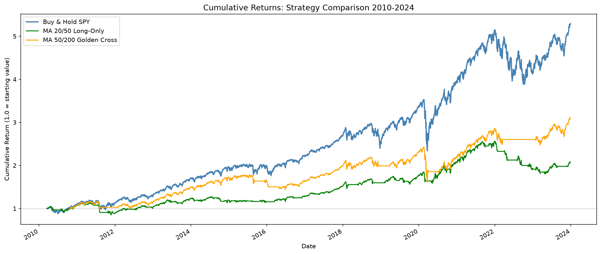
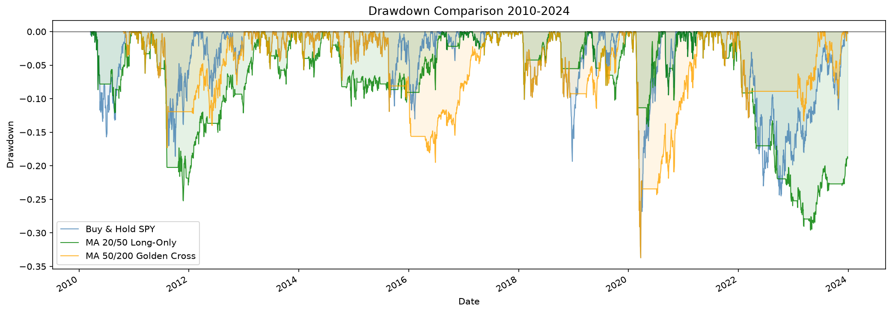
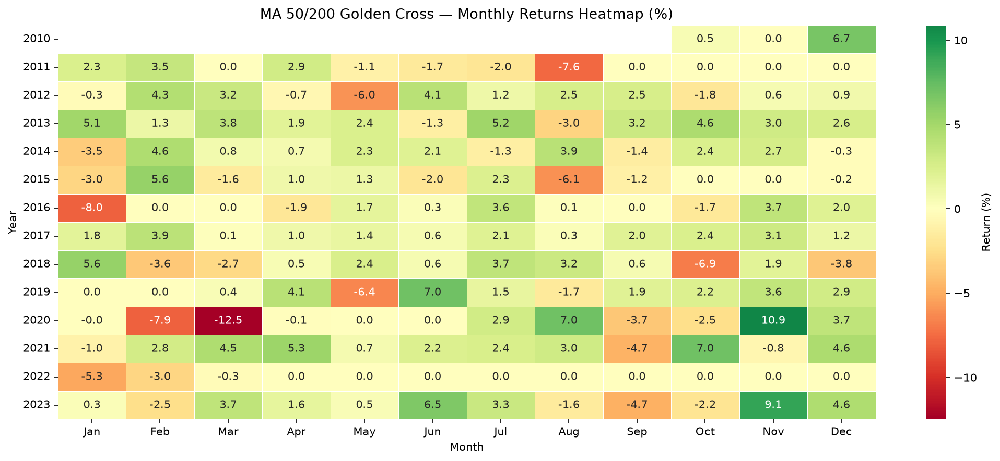
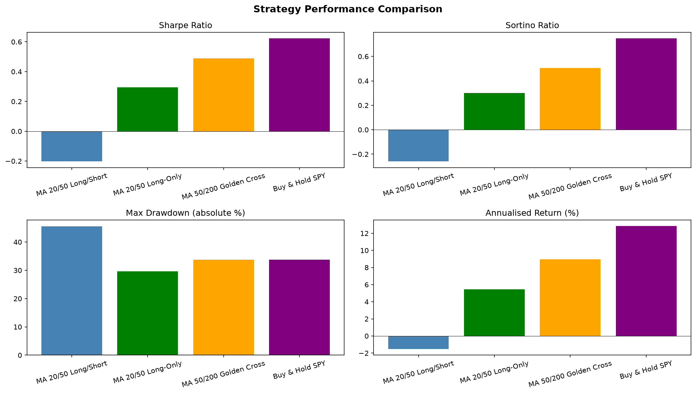
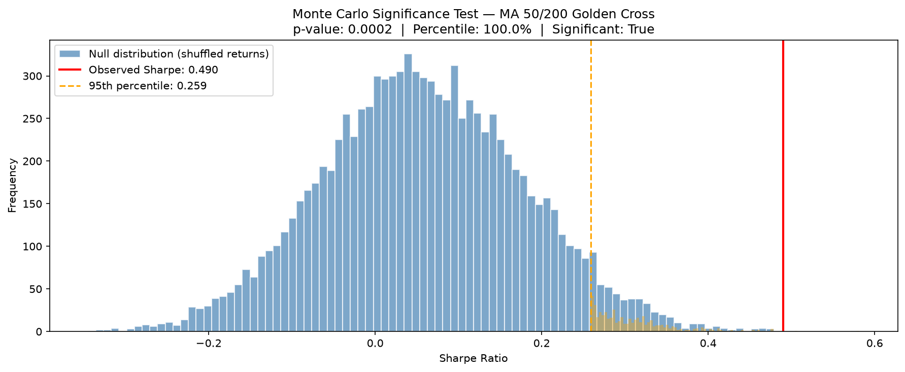

# Quantitative Trading Backtester 

A systematic backtesting framework built in Python to evaluate 
quantitative trading strategies on historical market data. 
Developed as an independent summer project to demonstrate quantitative 
research methodology, statistical analysis, and software 
engineering skills.

---

## Project Overview

---

This project implements a full backtesting pipeline from raw 
price data through to strategy evaluation and performance 
reporting. The framework is designed with a rigorous methodology,
taken from Ernest Chan's book "Algorithmic Trading," 
explicitly avoiding common backtesting pitfalls 
such as look-ahead bias, survivorship bias, and in-sample 
overfitting.

The primary asset under investigation is SPY (S&P 500 ETF), 
covering the period 2010–2024, providing exposure to multiple 
market regimes including bull markets, the 2020 COVID crash, 
and the 2022 bear market.

---

## Project Structure

---
       
    quant-backtester/
    ├── data/                   # Raw and processed data storage
    ├── src/
    │   ├── data_pipeline.py    # Data download, validation, returns
    │   ├── features.py         # Feature engineering, ADF test,
    │   │                       # Hurst exponent
    │   ├── signals.py          # Signal generation
    │   ├── backtester.py       # Core backtesting engine
    │   ├── metrics.py          # Performance metrics
    │   └── visualisation.py    # Plotting and reporting
    ├── notebooks/
    │   └── SPY_MA_Crossover_Analysis.ipynb
    ├── requirements.txt
    └── README.md

---

## Statistical Analysis — Asset Selection

---

Before implementing any strategy, SPY was tested for mean 
reversion using two established methods from Chan (2013): 
the Augmented Dickey-Fuller (ADF) test and the Hurst exponent.

### Augmented Dickey-Fuller Test

| Series | Test Statistic | p-value | Mean-Reverting |
|---|---|---|---|
| SPY Price | 0.6301 | 0.9883 | No |
| SPY Log Returns | -12.7941 | 0.0000 | Yes |

The SPY price series yields p = 0.9883, far above the 0.05 
significance threshold. We fail to reject the null hypothesis 
of a unit root — the price series is non-stationary and 
unsuitable for mean reversion strategies.

The log returns series yields p ≈ 0.0, confirming returns 
are stationary and bounce around a stable mean, consistent 
with efficient market behaviour at the daily level.

### Hurst Exponent

| Series | Hurst Exponent | Interpretation |
|---|---|---|
| SPY Price | 0.4076 | Weakly mean reverting |
| SPY Log Returns | -0.0011 | Random walk |

The Hurst exponent on the price series (H = 0.4076) is 
below 0.5 but only marginally, indicating insufficient mean 
reversion to support a profitable mean reversion strategy. 
The returns series (H ≈ 0) confirms near-random walk 
behaviour at the daily level.

### Strategy Selection ###

Based on this statistical analysis, a momentum-based moving 
average crossover strategy was selected as the appropriate 
approach for SPY. The mildly trending nature of the price 
series (confirmed by the long-run upward drift visible in 
the price chart) makes trend-following more statistically 
justified than mean reversion for this asset.

This follows the methodology outlined in Chan, E. (2013), 
*Algorithmic Trading: Winning Strategies and Their Rationale*.

---

## Data

---

- **Source**: Yahoo Finance via the `yfinance` Python library
- **Asset**: SPY (SPDR S&P 500 ETF Trust)
- **Period**: January 2010 — January 2024
- **Frequency**: Daily OHLCV data, adjusted for splits and 
  dividends
- **Observations**: 3,472 trading days after feature 
  engineering

### Key Data Characteristics 

| Metric | Value |
|---|---|
| Mean daily log return | 0.0005 |
| Daily volatility | 0.0109 |
| Annualised volatility | 17.38% |
| Skewness | -0.7178 |
| Kurtosis | 11.51 |

The return distribution exhibits significant negative skew 
(-0.72) and excess kurtosis (11.51 vs 3.0 for a normal 
distribution), confirming fat-tailed behaviour. Large 
negative moves occur more frequently than a normal 
distribution would predict — a well-established empirical 
property of equity returns with important implications for 
risk measurement.

---

## Methodology

---

### Look-Ahead Bias Prevention

All signals are generated using only information available 
at the time of the decision. Specifically, signals computed 
from end-of-day prices on day T are shifted forward by one 
day and executed at day T+1. This is implemented via 
`.shift(1)` in the signal generation module and is the 
single most important correctness requirement in backtesting.

*Reference: Chan (2013), Chapter 3*

---

### Strategies Tested ###

Three variants of the moving average crossover were tested:

| Strategy | Description |
|---|---|
| MA 20/50 Long/Short | Long when SMA20 > SMA50, short otherwise |
| MA 20/50 Long-Only | Long when SMA20 > SMA50, flat otherwise |
| MA 50/200 Golden Cross | Long when SMA50 > SMA200, flat otherwise |

Transaction costs of 0.1% per trade were applied throughout, 
representing realistic costs for a liquid ETF.

*Reference: Kissell (2013); Chan (2013)*

---

## Results

---

### Full Period Performance (2010-2024)

| Strategy | Total Return | Ann. Return | Volatility | Sharpe | Sortino | Max DD | Trades |
|---|---|---|---|---|---|---|---|
| MA 20/50 Long/Short | -19.1% | -1.5% | 17.4% | -0.202 | -0.259 | -45.5% | 70 |
| MA 20/50 Long-Only | 107.8% | 5.5% | 11.7% | 0.295 | 0.301 | -29.6% | 35 |
| MA 50/200 Golden Cross | 210.1% | 9.0% | 14.2% | 0.490 | 0.504 | -33.7% | 6 |
| Buy & Hold SPY | 428.0% | 12.8% | 17.4% | 0.623 | 0.747 | -33.7% | 0 |

**Key observations:**

- The long/short strategy failed due to costly short positions 
  during the bull market and excessive whipsawing (70 trades, 
  14% total transaction costs)
- Switching to long-only reduced maximum drawdown to -29.6% — 
  lower than both buy and hold and the Golden Cross
- The Golden Cross achieves the best risk-adjusted performance 
  of the active strategies, with a Sharpe ratio 79% of 
  buy and hold's despite making only 6 trades over 14 years
- All active strategies underperform buy and hold on raw 
  returns, consistent with the semi-strong form efficient 
  market hypothesis for a highly liquid, widely followed asset

### Cumulative Returns



### Drawdown Comparison



### Monthly Returns Heatmap — Golden Cross 50/200



### Metrics Comparison



## Walk-Forward Testing

### Walk-Forward Testing Limitation

The 50/200 parameter combination was selected based on 
full-period performance rather than through systematic 
in-sample optimisation across a parameter grid. A more 
rigorous implementation would define a grid of fast/slow 
window combinations, select the optimal parameters using 
in-sample data only, and report out-of-sample results for 
that combination exclusively. This represents a direction 
for future work.

---

### Walk-Forward Testing Methodology

Data was split into two non-overlapping periods to assess 
out-of-sample robustness:

- **In-sample (2010-2018)**: 2,213 trading days
- **Out-of-sample (2019-2024)**: 1,258 trading days

The out-of-sample period deliberately includes the 2020 
COVID crash and 2022 bear market — genuinely difficult 
conditions differing substantially from the training period.

### Walk-Forward Results — Golden Cross 50/200 ###

| Metric | In-Sample | Out-of-Sample |
|---|---|---|
| Sharpe Ratio | 0.490 | 0.410 |
| Sortino Ratio | 0.547 | 0.384 |
| Annualised Return | 8.0% | 9.3% |
| Annualised Volatility | 12.3% | 17.7% |
| Max Drawdown | -19.5% | -33.7% |
| Win Rate | 54.9% | 56.1% |

The Sharpe ratio degrades by only 16% out-of-sample, 
indicating genuine robustness. The annualised return 
improves slightly (8.0% → 9.3%), suggesting the strategy's 
risk management characteristics become more valuable in 
volatile regimes. The increase in volatility and drawdown 
reflects the more turbulent 2019-2024 market environment 
rather than any failure of the strategy.

*References: Chan (2013), pp. 67-71; López de Prado (2018), Ch. 7*

---

## Monte Carlo Significance Testing

| Period | Observed Sharpe | 95th Percentile (Null) | p-value | Significant |
|---|---|---|---|---|
| In-sample (2010-2018) | 0.490 | 0.259 | 0.0002 | Yes |
| Out-of-sample (2019-2024) | 0.410 | — | 0.0213 | Yes |

The observed Sharpe ratio of 0.490 exceeds every single 
one of 10,000 random signal timings (100th percentile), 
with p = 0.0002. Out-of-sample significance is maintained 
at p = 0.0213, confirming timing skill generalises to 
genuinely unseen data.

The statistical significance confirms that the observed 
historical performance is unlikely to be random. Importantly,
this does not guarantee future performance as markets evolve and
signals that exhibited timing skill may not be retained in future 
regimes. 

*Reference: López de Prado (2018), Chapter 8*

### Monte Carlo Plot



---

## Reproducing the Analysis

Clone the repository, install dependencies with 
`pip install -r requirements.txt`, and open 
`notebooks/SPY_MA_Crossover_Analysis.ipynb`.

---

## Dependencies ##

```
yfinance
pandas
numpy
matplotlib
seaborn
scipy
statsmodels
jupyter
```

---

## References

- Bailey, D.H. and López de Prado, M. (2014). The Deflated 
  Sharpe Ratio. *Journal of Portfolio Management*, 40(5), 
  94-107.
- Chan, E. (2013). *Algorithmic Trading: Winning Strategies 
  and Their Rationale*. Wiley.
- Dickey, D.A. and Fuller, W.A. (1979). Distribution of 
  the Estimators for Autoregressive Time Series With a 
  Unit Root. *Journal of the American Statistical 
  Association*, 74(366), 427-431.
- Huang, D. et al. (2020). Predicting the Stock Market 
  with Golden and Death Crosses. SSRN Working Paper. 
  https://ssrn.com/abstract=3558913
- Hull, J.C. (2018). *Options, Futures, and Other 
  Derivatives*, 10th ed. Pearson.
- Hurst, H.E. (1951). Long-Term Storage Capacity of 
  Reservoirs. *Transactions of the American Society of 
  Civil Engineers*, 116, 770-799.
- Jegadeesh, N. and Titman, S. (1993). Returns to Buying 
  Winners and Selling Losers. *Journal of Finance*, 
  48(1), 65-91.
- Kissell, R. (2013). *The Science of Algorithmic Trading 
  and Portfolio Management*. Academic Press.
- López de Prado, M. (2018). *Advances in Financial 
  Machine Learning*. Wiley.
- Magdon-Ismail, M. and Atiya, A. (2004). Maximum 
  Drawdown. *Risk Magazine*, 17(10), 99-102.
- Murphy, J.J. (1999). *Technical Analysis of the 
  Financial Markets*. New York Institute of Finance.
- Pardo, R. (2008). *The Evaluation and Optimization of 
  Trading Strategies*, 2nd ed. Wiley.
- Sharpe, W.F. (1994). The Sharpe Ratio. *Journal of 
  Portfolio Management*, 21(1), 49-58.
- Sortino, F.A. and van der Meer, R. (1991). Downside 
  Risk. *Journal of Portfolio Management*, 17(4), 27-31.
- Young, T.W. (1991). Calmar Ratio: A Smoother Tool. 
  *Futures Magazine*, 20(1).

